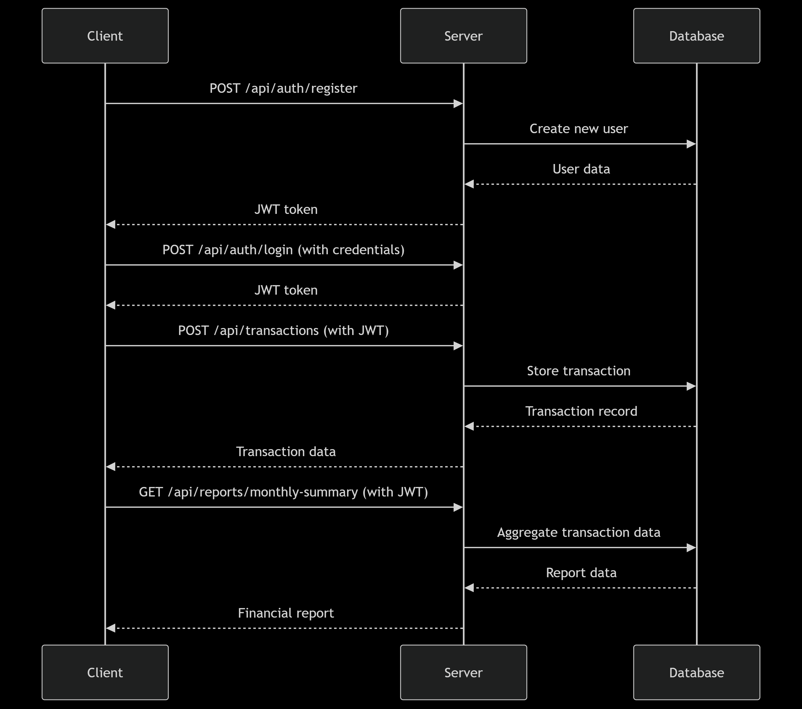

# FinTrackr API

**FinTrackr** is a robust RESTful API designed to help users manage their personal finances effectively. This API enables users to track income and expenses, set budgets, receive alerts, and analyze spending patterns through comprehensive reports. With secure authentication and intuitive endpoints, FinTrackr provides a solid backend for personal finance applications.

---

## 🚀 Key Features

- 💰 **Transaction tracking** (income/expenses)
- 📊 **Budget management** with alerts
- 📈 **Financial reports** and analytics
- 🔐 **JWT authentication**
- 📧 **Email notifications**
- 📄 **CSV export functionality**

---

## 🛠️ Tech Stack

| Layer       | Technology                  |
| ----------- | --------------------------- |
| Language    | JavaScript (ES6+)           |
| Runtime     | Node.js                     |
| Framework   | Express.js                  |
| Database    | MongoDB (with Mongoose ODM) |
| Auth        | JWT + bcryptjs              |
| Email       | Nodemailer                  |
| Scheduling  | node-cron                   |
| Data Export | json2csv                    |

---

## 🔄 API Flow

### 📌 Authentication

| Method | Endpoint             | Description         | Example Request Body                                           |
| ------ | -------------------- | ------------------- | -------------------------------------------------------------- |
| POST   | `/api/auth/register` | Register new user   | `{"name":"John","email":"john@test.com","password":"pass123"}` |
| POST   | `/api/auth/login`    | Login existing user | `{"email":"john@test.com","password":"pass123"}`               |
| GET    | `/api/auth/profile`  | Get user profile    | Requires JWT token                                             |
| PUT    | `/api/auth/profile`  | Update user profile | `{"name":"John Updated","currency":"EUR"}`                     |

---

### 💸 Transactions

| Method | Endpoint                | Description            | Example Request Body                                |
| ------ | ----------------------- | ---------------------- | --------------------------------------------------- |
| POST   | `/api/transactions`     | Create transaction     | `{"amount":100,"type":"expense","category":"food"}` |
| GET    | `/api/transactions`     | Get all transactions   | Optional query: `?type=expense&category=food`       |
| GET    | `/api/transactions/:id` | Get single transaction | Requires JWT token                                  |
| PUT    | `/api/transactions/:id` | Update transaction     | `{"amount":150,"description":"Updated"}`            |
| DELETE | `/api/transactions/:id` | Delete transaction     | Requires JWT token                                  |

---

### 📈 Budgets

| Method | Endpoint           | Description          | Example Request Body                                  |
| ------ | ------------------ | -------------------- | ----------------------------------------------------- |
| POST   | `/api/budgets`     | Create/update budget | `{"category":"food","amount":300,"period":"monthly"}` |
| GET    | `/api/budgets`     | Get all budgets      | Requires JWT token                                    |
| GET    | `/api/budgets/:id` | Get single budget    | Requires JWT token                                    |
| PUT    | `/api/budgets/:id` | Update budget        | `{"amount":350,"notifications":false}`                |
| DELETE | `/api/budgets/:id` | Delete budget        | Requires JWT token                                    |

---

### 📊 Reports

| Method | Endpoint                       | Description                | Example Query Params                       |
| ------ | ------------------------------ | -------------------------- | ------------------------------------------ |
| GET    | `/api/reports/monthly-summary` | Monthly financial summary  | `?year=2023&month=7`                       |
| GET    | `/api/reports/trends`          | Spending trends            | `?months=6`                                |
| GET    | `/api/reports/suggestions`     | Saving suggestions         | Requires JWT token                         |
| GET    | `/api/reports/export`          | Export transactions to CSV | `?startDate=2023-01-01&endDate=2023-12-31` |