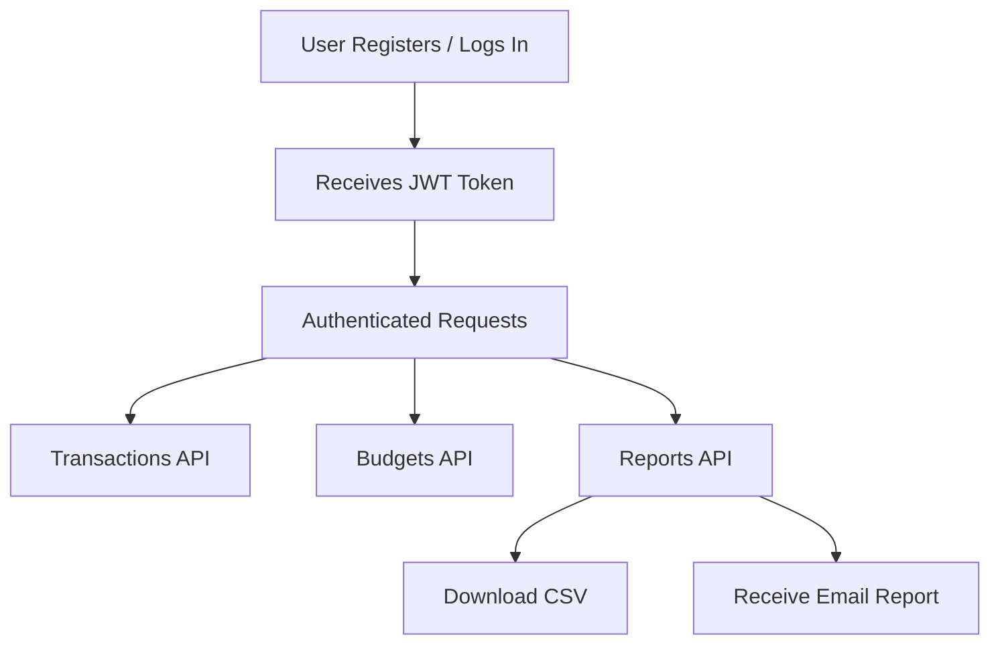

# FinTrackr API

**FinTrackr** is a robust RESTful API designed to help users manage their personal finances effectively. This API enables users to track income and expenses, set budgets, receive alerts, and analyze spending patterns through comprehensive reports. With secure authentication and intuitive endpoints, FinTrackr provides a solid backend for personal finance applications.

---

## 🚀 Key Features

- 💰 **Transaction tracking** (income/expenses)
- 📊 **Budget management** with alerts
- 📈 **Financial reports** and analytics
- 🔐 **JWT authentication**
- 📧 **Email notifications**
- 📄 **CSV export functionality**

---

## 🛠️ Tech Stack

| Layer       | Technology                  |
| ----------- | --------------------------- |
| Language    | JavaScript (ES6+)           |
| Runtime     | Node.js                     |
| Framework   | Express.js                  |
| Database    | MongoDB (with Mongoose ODM) |
| Auth        | JWT + bcryptjs              |
| Email       | Nodemailer                  |
| Scheduling  | node-cron                   |
| Data Export | json2csv                    |

---

## 🚦 Quickstart & Setup

1. **Clone the repository**
   ```sh
   git clone <your-repo-url>
   cd FINANCE-TRACKER-API
   ```
2. **Install dependencies**
   ```sh
   npm install
   ```
3. **Configure environment variables**
   - Copy `.env.example` to `.env` and fill in:
     - `MONGO_URI` (your MongoDB connection string)
     - `JWT_SECRET` (for authentication)
     - `EMAIL_USERNAME` and `EMAIL_PASSWORD` (for Nodemailer)
     - Any other required fields
4. **Start the server**
   ```sh
   npm start
   ```
   The API runs by default on `http://localhost:5000` (see your `.env`)

---

## 🧪 Using the API in Postman

1. **Register a new user**
   - `POST /api/auth/register`
   - Body: `{ "name": "John", "email": "john@test.com", "password": "pass123" }`
2. **Login**
   - `POST /api/auth/login`
   - Body: `{ "email": "john@test.com", "password": "pass123" }`
   - Copy the `token` from the response.
3. **Set JWT in Postman**
   - In your request, go to the "Authorization" tab.
   - Type: `Bearer Token`, paste your JWT token.
4. **Use Authenticated Routes**
   - Now you can access `/api/transactions`, `/api/budgets`, `/api/reports/*`, etc.
5. **Example: Create a transaction**
   - `POST /api/transactions`
   - Body: `{ "amount": 100, "type": "expense", "category": "food" }`
6. **Export CSV**
   - `GET /api/reports/export?startDate=YYYY-MM-DD&endDate=YYYY-MM-DD`
   - The response will be a CSV file you can download.
7. **Receive Email Reports**
   - Reports are sent automatically on the 1st of each month.
   - To send a report manually, see below.

---

## 📨 Sending Manual Monthly Report Emails (with CSV)

You can send yourself (or any user) a monthly report email with CSV attachment instantly:

1. **Edit `sendReportNow.js`**
   - Change the email in this line to your user email:
     ```js
     const user = await User.findOne({ email: "your@email.com" });
     ```
2. **Run the script**
   ```sh
   node sendReportNow.js
   ```
   This will send the monthly report email for the previous month to the specified user.

---

## 🔄 API Flow Diagram



---

### **Authentication**

| Method | Endpoint           | Description       | Example Body / Notes        |
| ------ | ------------------ | ----------------- | --------------------------- |
| POST   | /api/auth/register | Register new user | `{ name, email, password }` |
| POST   | /api/auth/login    | Login             | `{ email, password }`       |
| GET    | /api/auth/profile  | Get user profile  | JWT required                |
| PUT    | /api/auth/profile  | Update profile    | `{ name, currency }`        |

---

### **Transactions**

| Method | Endpoint              | Description        | Example Body / Params                   |
| ------ | --------------------- | ------------------ | --------------------------------------- |
| POST   | /api/transactions     | Create transaction | `{ amount, type, category, ... }`       |
| GET    | /api/transactions     | List transactions  | Optional: `?type=expense&category=food` |
| GET    | /api/transactions/:id | Get transaction    |                                         |
| PUT    | /api/transactions/:id | Update transaction | `{ amount, description, ... }`          |
| DELETE | /api/transactions/:id | Delete transaction |                                         |

---

### **Budgets**

| Method | Endpoint         | Description          | Example Body / Notes           |
| ------ | ---------------- | -------------------- | ------------------------------ |
| POST   | /api/budgets     | Create/update budget | `{ category, amount, period }` |
| GET    | /api/budgets     | List budgets         |                                |
| GET    | /api/budgets/:id | Get budget           |                                |
| PUT    | /api/budgets/:id | Update budget        | `{ amount, notifications }`    |
| DELETE | /api/budgets/:id | Delete budget        |                                |

---

### **Reports**

| Method | Endpoint                     | Description               | Example Params / Notes                     |
| ------ | ---------------------------- | ------------------------- | ------------------------------------------ |
| GET    | /api/reports/monthly-summary | Monthly summary           | `?year=2023&month=7`                       |
| GET    | /api/reports/trends          | Spending trends           | `?months=6`                                |
| GET    | /api/reports/suggestions     | Saving suggestions        |                                            |
| GET    | /api/reports/export          | Export transactions (CSV) | `?startDate=YYYY-MM-DD&endDate=YYYY-MM-DD` |

---

## 🚧 Future Implementation

Here are some ideas and planned enhancements for future versions of FinTrackr:

- **Mobile App Integration:**
  - Build a React Native or Flutter app to interact with the API.
- **Recurring Transactions:**
  - Support for auto-adding recurring expenses/incomes (e.g., rent, subscriptions).
- **Multi-currency Support:**
  - Allow users to track finances in multiple currencies with live exchange rates.
- **Advanced Analytics & AI:**
  - Personalized savings advice, anomaly detection, and spending forecasts.
- **Push Notifications:**
  - Real-time alerts for budget thresholds and important events.
- **OAuth & Social Login:**
  - Google, Facebook, or Apple login support for easier onboarding.
- **Admin Dashboard:**
  - Web dashboard for managing users, monitoring usage, and analytics.
- **Custom Categories & Tags:**
  - Let users define custom transaction categories and add tags for better filtering.
- **Data Import/Export:**
  - Import data from banks or other finance apps; enhanced export options.
- **Improved Security:**
  - 2FA, audit logs, and enhanced password policies.
- **API Documentation:**
  - Swagger/OpenAPI docs for easier developer onboarding.

_Have more ideas? Open an issue or contribute to the project!_
